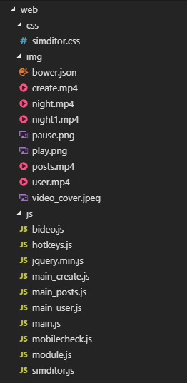
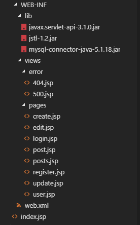
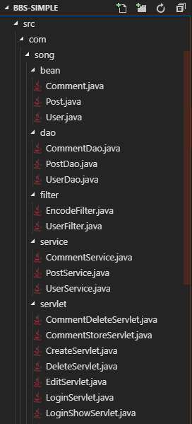
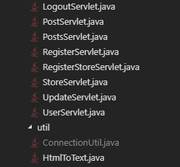
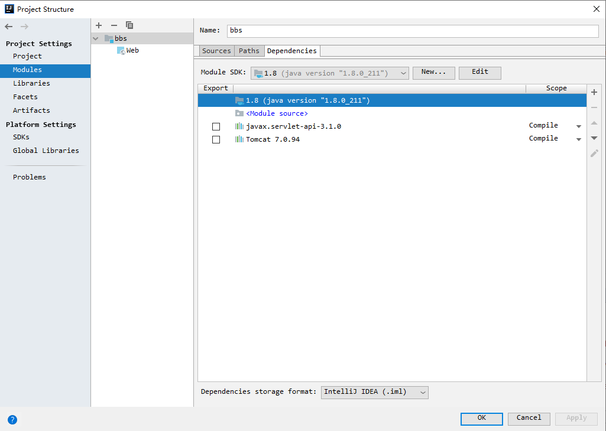
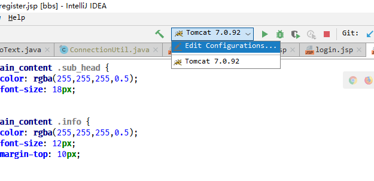
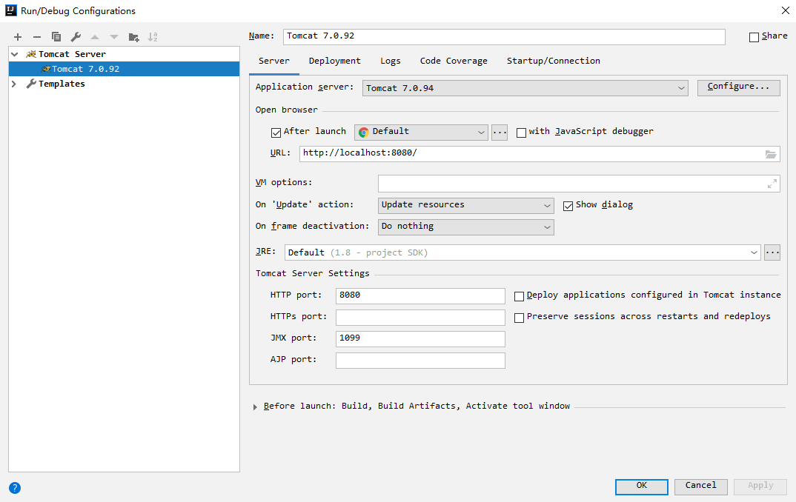
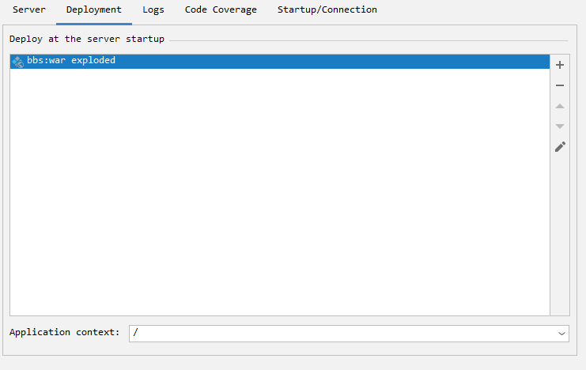
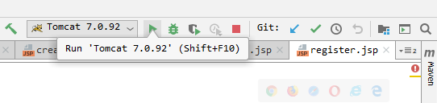

# 软件代码使用说明

## 环境介绍

本项目基于

- Java 8 
- Tomcat 7
- MySQL 5.4 

 开发，在运行代码前请先安装相应环境。

在项目开发的过程中，我们使用了git和GitHub进行版本控制，详情请参见本项目GitHub页面的[commit log](https://github.com/Anthony-Hoo/BBS-simple/commits/master)

另外，我们采用的IDE是IntelliJ IDEA，请不要使用eclipse或其它IDE打开这个工程。

## 代码结构介绍

本项目代码包含以下几个部分：

1. 前端页面代码（位于`web/`）
2. 后端Java代码（位于 `src/` ）
3. 建立数据库的SQL语句（`bbs.sql`）
4. Java编译的字节码文件以及IDE产生的调试文件（位于`out/`）
5. IDE的配置文件和工作区文件（`.idea/` 、`bbs.iml`）
6. git的提交记录，ignore配置（`.git/`、`.gitignore`、`.gitattributes`）
7. 项目的设计文档（`设计文档/`）

### 前端代码结构

### Java后端代码结构

## 数据库配置

1. 链接MySQL，按照bbs.sql的代码建立数据库。
2. 完成

## IDE配置

1. 用IDEA打开工程文件夹后，打开`project structure`设置面板，选择`module`设置，配置好JDK路径和Tomcat路径。
2. 在环境配置中选择编辑配置设置Tomcat路径和启动浏览器
3. 在Deployment选项卡中配置web根目录
4. 点击run
5. 等待片刻，服务器加载完成后浏览器会自动打开窗口